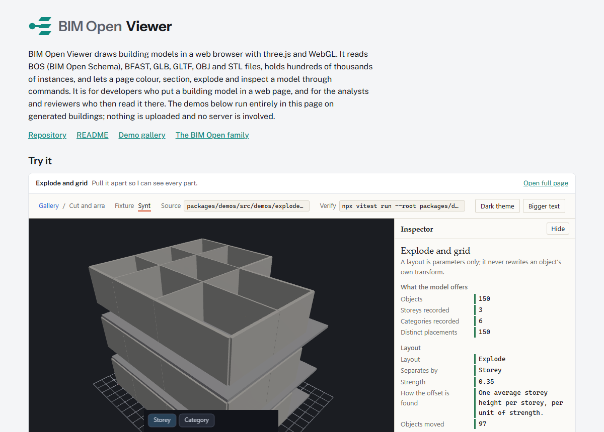

<p></p>

**Try it in the browser: <https://ara3d.github.io/bim-open-viewer/>**

BIM Open Viewer is a library for drawing building models in a web page. It is written in
TypeScript on [three.js](https://threejs.org/) and WebGL, reads BOS (BIM Open Schema), BFAST,
GLB, GLTF, OBJ and STL files into one model, and draws hundreds of thousands of instances with
per-object colour, sections, exploded layouts and picking. It is for developers who embed a
building model in a web application, and for the reviewers and analysts who then inspect the
model there. It is the successor to `@ara3d/ara3d-webgl`, and the 3D viewer of the
[BIM Open family](https://github.com/ara3d/bim-open-toolkit). The renderer, navigation and
features know nothing about any file format; `@bim-open-viewer/formats` and
`@bim-open-viewer/loaders` adapt each format to the model.



The viewer was developed inside [BIM Open Toolkit](https://github.com/ara3d/bim-open-toolkit),
which consumes this repository through its `deps/` folder, at `deps/bim-open-viewer`; this
repository keeps that history.

This is an npm workspace with seventeen packages, split so they can be developed
independently.

## Foundation

| Package | Role |
|---|---|
| [`@bim-open-viewer/model`](packages/model/) | Pure data contracts and operations: identity, coordinates, sets, style rules, edits, view state, document slices, schema combinators, `Result`, facts, `Table`, mesh POD, and the `Feature` / `Command` / `StateSlice` / `Event` contracts. No runtime dependencies at all — no three.js, no renderer, no browser API, no other package here — so it runs unchanged in a test, in Node, in a browser, and in an MCP server. |

## Renderer

| Package | Role |
|---|---|
| [`@bim-open-viewer/core`](packages/core/) | Renderer: scene management, instanced drawing, materials, per-instance color, frame loop |
| `@bim-open-viewer/loaders` | Ingestion: GLB and BOS loading into viewer-core scene structures, with incremental progress reporting |
| `@bim-open-viewer/controls` | Interaction: orbit camera navigation, picking and selection with typed events, section planes. Owns no scene content. |

## Composition

| Package | Role |
|---|---|
| `@bim-open-viewer/render` | The instance table bound to viewer-core groups, representation registry, picking, clipping, environment, overlay primitives, capture and frame timing |
| `@bim-open-viewer/interact` | Camera state math, orbit / first-person / overhead navigation, configurable bindings, touch, and interruptible camera animation |
| `@bim-open-viewer/formats` | BOS, BFAST, GLB, GLTF, OBJ and STL adapters producing one normalized `LoadedModel` with a columnar representation table — reporting their failures instead of raising them |
| `@bim-open-viewer/features` | One Feature module per capability — appearance, clipping, annotations, animation, comparison, edits, environment, HUD, layouts, capture — each owning its commands, state slice, schema and optional render hook |
| `@bim-open-viewer/workflows` | Pure result adapters and recipes for the review workflows: input tables in; typed results, rules, sets, overlays and views out |
| [`@bim-open-viewer/viewer`](packages/viewer/) | The default composition: `createViewer`, the command bus, feature host, slice persistence and multi-view |

## User interface

| Package | Role |
|---|---|
| `@bim-open-viewer/ui-react` | React bindings — `useViewer`, `useSelection`, `useSlice` — and the review application |
| `@bim-open-viewer/ui-gratify` | The Gratify layer: in-canvas panels, the sidebar property inspector, widget kit, theme bridge and semantics mirror |
| [`@bim-open-viewer/visualization`](packages/visualization/) | Composable model identity, review state, appearance/edit layers, persistence and renderer bindings |

## Fixtures, testing and hosts

| Package | Role |
|---|---|
| `@bim-open-viewer/synthetic` | Seeded generators for buildings, networks, schedules, revisions, facts with gaps, stress scenes and mesh primitives |
| `@bim-open-viewer/testing` | Fixture builders, fake clocks, headless scene helpers, the browser runner and the benchmark protocol |
| `@bim-open-viewer/demos` | Gallery host, feature demos, workflow demos, fixture server and browser specs |
| `@bim-open-viewer/mcp` | Node bridge exposing viewer commands as MCP tools over a WebSocket to a browser session |

## Using it

The facade is three lines:

```ts
import { createViewer } from '@bim-open-viewer/viewer';

const viewer = createViewer(canvas);
await viewer.open('/models/building.bfast');
viewer.run('view.fit', {});
```

That is a renderer on the canvas, a model loaded and drawn, navigation on the pointer,
click to select, a frame loop that draws only when something changed, a resize observer,
and one `dispose()` that leaves nothing behind. Changing appearance goes through the same
door — a command — rather than a second API:

```ts
import { styleRule } from '@bim-open-viewer/model';

viewer.apply(styleRule('unrated', 'Unrated doors', unratedDoorKeys, { color: [1, 0, 0] }));
```

Design requirements carried over from the previous viewer's lessons:

- `three` is a **peer dependency** of every package — the host application picks
  the version, and only one copy of three ever loads.
- All numeric parameters are floats (plain `number`); no integer-quantized APIs.
- Per-instance color is a first-class API, changeable after creation.
- Scene structures support incremental population, so loaders can stream
  geometry in and report progress.

The visualization alpha includes 23 independent feature demos, primarily using the local
Snowdon fixture. After installing and running `npm run build`, use `npm run demo`.
`npm run demo:snowdon`, `npm run demo:normalized` and `npm run demo:browser` check the
served fixture, normalized geometry and browser behavior. See the
[package README](packages/visualization/README.md) for setup, evidence and remaining scope.

## The static site

The live page is the demo gallery built as plain files, with every demo that needs the private
Snowdon model left out. It opens three real buildings whose licences allow redistribution, and the
other demos open a generated building from `@bim-open-viewer/synthetic`.

| Building | Models drawn together | Licence |
|---|---|---|
| Schependomlaan, a ten-apartment block | architecture (one Archicad design model) | CC BY 4.0, (C) original owners |
| DigitalHub, an office building of RWTH Aachen University | architecture, and heating in red | MIT, (c) 2020 RWTH Aachen University, E3D |
| Duplex Apartment, a two-unit house | architecture, MEP in blue, electrical in amber, rooms and heating in red | CC BY 4.0, BSI (2020), buildingSMART International |

Each building is the `public-buildings` demo on one fixture
(`gallery.html?demo=public-buildings&fixture=duplex`). When there is more than one model the
architecture is drawn at 10 % opacity so the systems inside it show, and spaces are hidden in all
three because their volumes enclose the rooms. Clicking an element reads its name, category,
model, storey and property sets in the inspector. The page shows each building's credit line under
the viewport and on its landing-page card.

DigitalHub's ventilation and plumbing models are not drawn: bim-open-data has them only inside a
federated archive with no geometry. The Duplex's electrical and rooms models repeat 104 and 344
elements of its MEP model, so those elements are drawn twice.

The files are BIM Open Schema archives from
[ara3d/bim-open-data](https://github.com/ara3d/bim-open-data/tree/main/samples/public), 3.3 MB in
all, and are not committed here. `packages/demos/src/demos/public-buildings/buildings.ts` lists
them and pins the bim-open-data commit they are read at; `npm run pages` downloads them from
raw.githubusercontent.com into `artifacts/public-samples/<commit>/` (git-ignored) and copies them,
with bim-open-data's `NOTICE.md`, into `dist-pages/samples/`. The gallery's dev server
(`npm run gallery`) serves them from the same cache. Moving the pin is how the site picks up newly
converted files.

`.github/workflows/pages.yml` builds and publishes the site on every push to `main`. GitHub Pages has to be switched on once by a repository owner: Settings, Pages,
Source: GitHub Actions. Until then the workflow's deploy step fails.

To build and check it locally, after `npm run build`:

```
npm run pages          # builds dist-pages/ (landing page index.html and gallery.html)
npm run pages:preview  # serves dist-pages/ at http://127.0.0.1:5191/
npm run pages:smoke    # opens every page headless and fails on a demo that does not draw or any page error
```

`pages:smoke` serves the built files, opens the landing page and every demo and building it lists
in Edge with software WebGL, fails a building page that shows no credit line, and also rewrites `docs/images/landing.png` and the static gallery's thumbnails in
`packages/demos/public/thumbnails/static/`. The landing page is `packages/demos/index.html`;
which fixtures a static build drops is decided in `packages/demos/src/gallery/hosting.ts`.

## Developing

The viewer needs Node.js 22 or later and git. Gratify, the canvas UI library behind
`@bim-open-viewer/ui-gratify`, is listed in `deps.json`; `node deps.mjs` clones it into
`deps/gratify` at the pinned commit (or links it, when this repository sits in a folder of
sibling checkouts marked with a `.deps-root` file). Run it before `npm install`.

```
git clone https://github.com/ara3d/bim-open-viewer
cd bim-open-viewer
node deps.mjs
npm install
npm run build
npm test -w @bim-open-viewer/core
```

`npm run build` builds Gratify first; the type check (`npm run typecheck`) reads Gratify's
built output, so run the build before it.

Unit tests run under Node with vitest and never require a WebGL context: the
three.js object-graph logic is kept separate from the `WebGLRenderer` so it is
testable headless.
